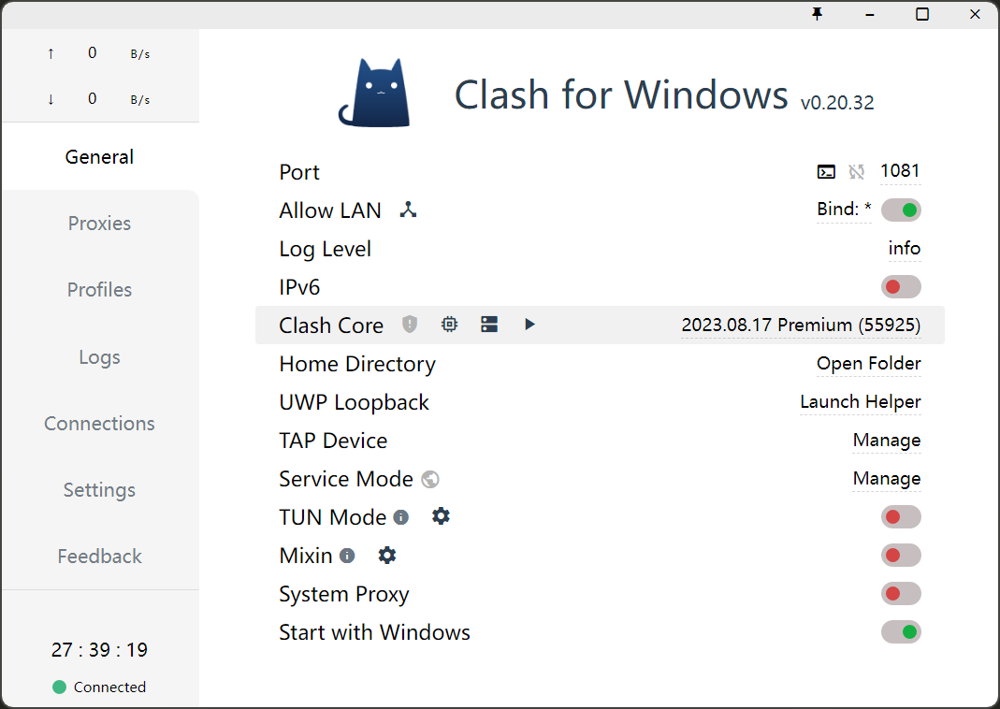
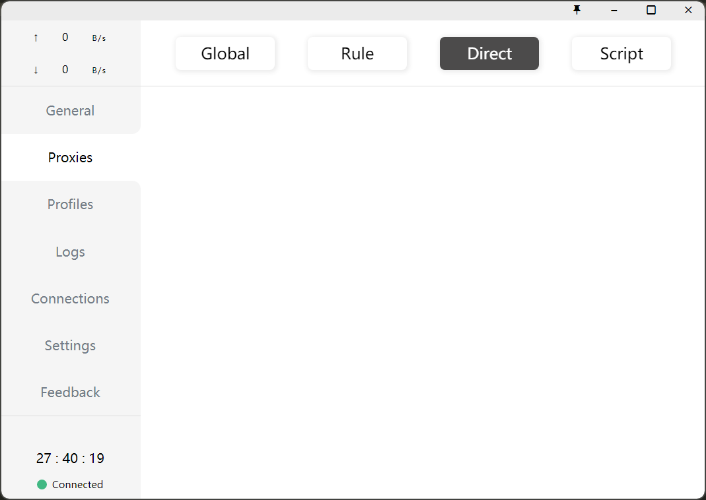

# 1. DAYU网络配置

> 部分同学有安装包的需求（如Python, R, Julia），需要联网。
> 下文讲述如何使用代理的方式，使DAYU访问外网。

> Dongdong Kong, CUG
> https://github.com/CUG-atmos/HPC-DAYU/blob/main/Internet_Proxy.md

## 1.1. 用户端

1. 安装clash, `https://github.com/Fndroid/clash_for_windows_pkg/releases`

- 端口修改为1081

- 勾选Allow LAN



- proxies选择Direct




2. ssh设置反向代理`RemoteForward 1081 localhost:1081`，使用client的网络

```bash
# 编辑 ~/.ssh/config
Host DaYu
    HostName 218.199.***.***
    RemoteForward 1081 localhost:1081
    Port 22
```


## 1.2. server端

在`~/.bashrc`加入如下命令，再重新登录，网络即可正常。

```bash
## VPN for Internet
vpn=http://localhost:1081
# git config --global http.proxy ${vpn}
# git config --global https.proxy ${vpn}
export http_proxy=${vpn}
export http_proxys=${vpn}
```
